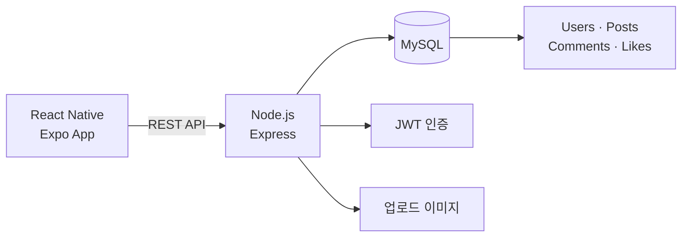

# BattleFit

<p align="center">
  
</p>

> 사용자의 운동 인증 기록을 소셜 피드와 도전 요소로 연결한 데이터베이스 수업 팀 프로젝트입니다.

## 프로젝트 설명

운동을 꾸준히 지속하기 어려운 문제를 해결하기 위해, 사진과 운동 정보를 게시하고 다른 사용자의 기록에 반응할 수 있는 모바일 SNS를 설계했습니다. 기본적인 회원·게시물·댓글·좋아요 관계를 MySQL로 모델링하고 React Native 앱과 Express API로 연결했습니다.

## 주요 기능

- 회원가입·로그인과 JWT 기반 인증
- 운동 종목, 운동 시간, 후기, 사진을 포함하는 인증 게시물
- 사용자별 운동 기록 피드
- 게시물 좋아요와 댓글
- 프로필 이미지와 선호 운동 태그
- 운동 여부, 연속 기록, 랭킹으로 확장 가능한 데이터 구조

## 서비스 구조



| 영역 | 사용 기술 | 역할 |
|---|---|---|
| Mobile | React Native, Expo | 로그인, 피드, 게시물 작성, 댓글 화면 |
| API | Node.js, Express | 인증과 게시물·댓글·좋아요 처리 |
| Database | MySQL | 사용자와 SNS 관계 데이터 저장 |
| Security | bcrypt, JWT | 비밀번호 해시와 요청 인증 |

## 개발 과정

1. 운동 인증과 친구 간 경쟁이라는 핵심 사용 시나리오를 정의했습니다.
2. `Users`, `Posts`, `Comments`, `Likes`를 중심으로 관계형 스키마를 설계했습니다.
3. Express 라우터에서 인증과 CRUD API를 분리했습니다.
4. React Native 화면에서 API 응답과 로컬 토큰을 연결했습니다.
5. 핵심 SNS 기능을 우선 구현하고 스트릭·대결·랭킹은 확장 범위로 구분했습니다.

## 담당 역할

- 초기 프로젝트 설계 아이디어 제시
- 데이터 흐름과 기능 범위 논의
- 백엔드 코드 일부 구현

## 저장소 구성

```text
battlefit/           # React Native / Expo 앱
battlefit-backend/   # Express API 서버
battlefit.sql        # 개인 데이터가 없는 스키마
```

## 프로젝트 범위 및 유의사항

- 데이터베이스 및 실습 과목의 팀 프로젝트를 포트폴리오 형태로 정리한 저장소입니다.
- 별도의 오픈소스 라이선스를 부여하지 않았으며, 소스의 재사용·재배포를 허가하는 저장소가 아닙니다.
- README의 담당 역할은 개인 기여 범위를 나타내며 전체 결과물은 팀 공동 작업입니다.
- 실제 DB 접속정보, JWT 비밀값, 업로드 파일, 사용자 데이터와 팀원 개인 정보는 제외했습니다.
- 스트릭·대결·랭킹은 기획상 확장 기능이며 현재 코드의 완성 범위와 다를 수 있습니다.
- 수업용 프로토타입으로 운영 환경의 보안·안정성·확장성을 보장하지 않습니다.
